<div align="center">
  
</div>

<br/>

<div align="center">

[](https://www.linkedin.com/in/dhruvanshi-patel-070105e18/)&nbsp;
[](mailto:pateldhruvanshi0@gmail.com)&nbsp;
[](https://unstop.com/u/ce072pat15689)&nbsp;
[](https://github.com/Dhruvanshi-Patel)&nbsp;
[](https://github.com/Dhruvanshi-Patel/PeerUp)


</div>

---

### 🕹️ `PLAYER_STATS.json` & Superpowers

<table>
<tr>
<td width="55%" valign="top">

```zsh
╭─ dhruvanshi@universe  ~/academic-career
╰─❯ cat whoami.json
{
  "name"        : "Dhruvanshi Patel",
  "email"       : "pateldhruvanshi0@gmail.com",
  "phone"       : "+91 8849269913",
  "linkedin"    : "dhruvanshi-patel-070105e18",
  "college"     : "Dharmsinh Desai University (DDU), Gujarat 🏫",
  "branch"      : "Computer Engineering (CE '25–Present)",
  "cgpa"        : 9.08,
  "percentage"  : "92%",
  "unstop_user" : "ce072pat15689",
  "github_user" : "Dhruvanshi-Patel",
  "status"      : "🟢 CE Student & Full-Stack Developer",
  "interests"   : ["Full-Stack Web Dev", "16-Bit UI/UX", "DevOps & FinOps", "Cloud Security"],
  "location"    : "Gujarat, India 🇮🇳"
}
```

```zsh
╭─ dhruvanshi@universe  ~/superpowers
╰─❯ ls -la

🍎  Academic Excellence @ DDU — CGPA 9.08 / 10 (92%)
👾  16-Bit Arcade Web Engine & SVG Header Generator
🚀  PeerUp — Omnikon Hackathon Project (Skill exchange Vercel app)
🏆  Tic Tech Toe '26 Hackathon Idea Submission @ DA-IICT
⚡  Proficient in C++, JavaScript, PHP & SQL / MS SQL Server
☁️  DevOps, FinOps & Cloud Security Architecture 2026
```

</td>
<td width="45%" valign="top" align="center">


<br/><br/>

<!-- Stat Badges -->

-FF007F?style=flat-square&logo=academia&logoColor=white)


</td>
</tr>
</table>

---

## 🚀 Built Projects & Repositories

<div align="center">

<table>
<tr>
<td width="50%" align="center" valign="top">

### 👾 16-Bit Arcade Web Engine & Profile
**Built Right Here (Interactive Portfolio Engine)**


```
HTML5 Canvas · Web Audio API · SVG Animation · Vanilla JS · CSS3
```

✅ **16-Bit Retro Pink Arcade Engine** with CRT scanlines  
✅ **SVG Flashing Title Banner Generator** ("HI i am dhruvanshi Patel")  
✅ **8-Bit Web Audio Synthesizer** for interactive SFX & starfield canvas  

[[](#)]

</td>
<td width="50%" align="center" valign="top">

### 🤝 PeerUp — Skill Exchange Platform
**Omnikon Hackathon Project**


```
JavaScript · HTML5 · CSS3 · Tailwind · Vercel
```

✅ **Peer-to-Peer Skill Exchange** web platform  
✅ Built for **Omnikon Hackathon** & deployed on Vercel  
✅ Interactive user dashboard & matching algorithm  

[[](https://github.com/Dhruvanshi-Patel/PeerUp)]

</td>
</tr>
<tr>
<td width="50%" align="center" valign="top">

### ☁️ DevOps & Cloud Security 2026
**Learning Architecture & Roadmap**


```
DevOps · FinOps · Cloud Security · CI/CD
```

✅ Comprehensive **DevOps & Cloud Security** architecture  
✅ Infrastructure cost management (FinOps) principles  
✅ Security compliance & automated pipeline structure  

[[](https://github.com/Dhruvanshi-Patel/devops-roadmap)]

</td>
<td width="50%" align="center" valign="top">

### 🎮 Tic Tech Toe '26 Innovation
**DA-IICT Gandhinagar Hackathon**


```
C++ · System Logic · Idea Architecture
```

✅ **Online Hackathon Idea Submission** @ DA-IICT  
✅ Problem solving & algorithm development  
✅ Technical submission evaluated by DA-IICT panel  

[[](https://unstop.com/u/ce072pat15689)]

</td>
</tr>
<tr>
<td width="50%" align="center" valign="top">

### 🗄️ Database & Web Systems
**PHP & Microsoft SQL Server Integration**


```
PHP · MS SQL Server · HTML5 · CSS3
```

✅ Dynamic backend database querying & management  
✅ Relational database schema optimization  
✅ Secure authentication & session handling  

[[](https://unstop.com/u/ce072pat15689)]

</td>
<td width="50%" align="center" valign="top">

### 🎬 Media & Technical Communication
**Video Editing & Content Creation**


```
Video Editing · Speech Delivery · Technical Writing
```

✅ Storytelling & video editing production  
✅ Technical documentation & speech delivery  
✅ Creative media integration into tech projects  

[[](https://unstop.com/u/ce072pat15689)]

</td>
</tr>
</table>

</div>

---

## 🛠 Tech Stack & Real Arsenal

<div align="center">

**Programming Languages & Core**


**Domains & Competencies**


</div>

---

## 🏆 Education & Competitions

<div align="center">

| | Institution / Event | Role / Course | Highlights |
|:---:|:---|:---|:---|
| 🏫 | **Dharmsinh Desai University (DDU), Gujarat** | Computer Engineering (2025–Present) | **CGPA: 9.08 / 10.0** (92%) |
| 👾 | **16-Bit Pink Pixel Arcade Project** | Lead Architect / Built Here | Custom Web Audio & SVG Flashing Engine |
| 🚀 | **Omnikon Hackathon** | Project Creator (`PeerUp`) | Skill exchange web app deployed on Vercel |
| 🎮 | **Tic Tech Toe '26 (DA-IICT Gandhinagar)** | Hackathon Participant | Idea submission & algorithmic design |
| 🎖️ | **Unstop Competitive Profile** | Competitor `@ce072pat15689` | 304 Points · Verified Badges |

</div>

---

## 🔮 What I Would Like To Do In Future (Quest Roadmap)

```
╔═══════════════════════════════════════════════════════════════════════════════════════════╗
║                             🎮 LEVELING UP: DHRUVANSHI'S ROADMAP                          ║
╠═══════════════════════════════════════════════════════════════════════════════════════════╣
║                                                                                           ║
║  [LEVEL 1] 🚀 Master Cloud Infrastructure, DevOps & FinOps                               ║
║             Build automated CI/CD pipelines with robust cloud security & cost monitoring. ║
║                                                                                           ║
║  [LEVEL 2] 🤝 Expand PeerUp & Open-Source Full-Stack Applications                        ║
║             Scale PeerUp to empower thousands of university students to exchange skills.  ║
║                                                                                           ║
║  [LEVEL 3] 🏆 Win Top-Tier National & International Hackathons                           ║
║             Compete in hackathons with high-impact software solutions.                    ║
║                                                                                           ║
║  [FINAL BOSS] 👑 Lead Engineering Teams & Innovate Big Tech Architecture                  ║
║             Architect scalable software solutions that impact millions of users globally. ║
║                                                                                           ║
╚═══════════════════════════════════════════════════════════════════════════════════════════╝
```

---

## 📬 Connect & Collaborate!

<div align="center">

[](https://www.linkedin.com/in/dhruvanshi-patel-070105e18/)&nbsp;
[](mailto:pateldhruvanshi0@gmail.com)&nbsp;
[](tel:+918849269913)&nbsp;
[](https://unstop.com/u/ce072pat15689)&nbsp;
[](https://github.com/Dhruvanshi-Patel)

<br/>

```
╔══════════════════════════════════════════════════════════════╗
║        Open to Software Engineering & Hackathon Collabs      ║
║             Let's connect and build at scale!                ║
╚══════════════════════════════════════════════════════════════╝
```

</div>
